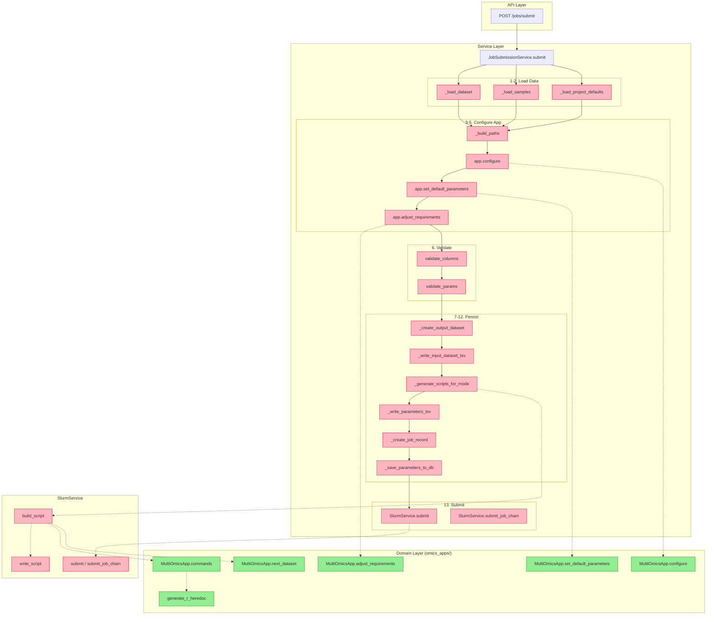
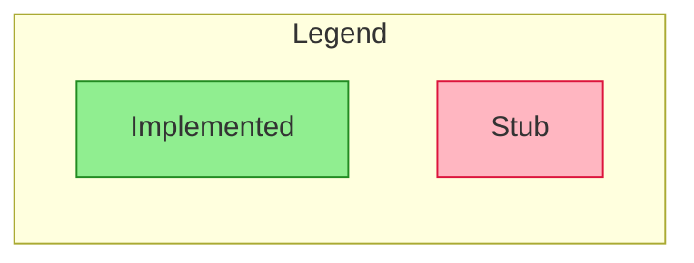
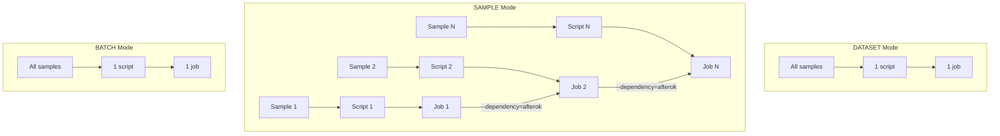
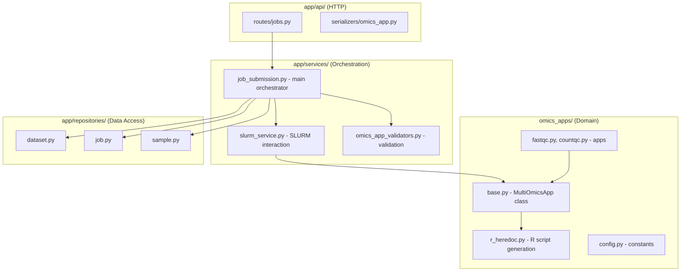

# Job Submission Flow

## High-Level Overview

## Implementation Status

| Step | Component | File | Status |
|------|-----------|------|--------|
| 1 | Load dataset | `job_submission.py` | 🔶 Stub |
| 2 | Load samples | `job_submission.py` | 🔶 Stub |
| 2 | Load project defaults | `job_submission.py` | 🔶 Stub |
| 3 | Build paths | `job_submission.py` | 🔶 Stub |
| 4 | Configure app | `base.py` | ✅ Done |
| 5 | set_default_parameters | `base.py` | ✅ Done |
| 5 | adjust_requirements | `base.py` | ✅ Done |
| 6 | Validate columns | `omics_app_validators.py` | 🔶 Stub |
| 6 | Validate params | `omics_app_validators.py` | 🔶 Stub |
| 7 | Create output dataset | `job_submission.py` | 🔶 Stub |
| 8 | Write input TSV | `job_submission.py` | 🔶 Stub |
| 9 | Generate scripts | `job_submission.py` | 🔶 Stub |
| 9 | Build SLURM script | `slurm_service.py` | 🔶 Stub |
| 9 | → commands() | `base.py` | ✅ Done |
| 9 | → R heredoc | `r_heredoc.py` | ✅ Done |
| 9 | → next_dataset() | `base.py` | ✅ Done |
| 9 | Write script | `slurm_service.py` | 🔶 Stub |
| 10 | Write parameters TSV | `job_submission.py` | 🔶 Stub |
| 11 | Create job record | `job_submission.py` | 🔶 Stub |
| 12 | Save params to DB | `job_submission.py` | 🔶 Stub |
| 13 | Submit to SLURM | `slurm_service.py` | 🔶 Stub |

## Process Modes

## File Locations

